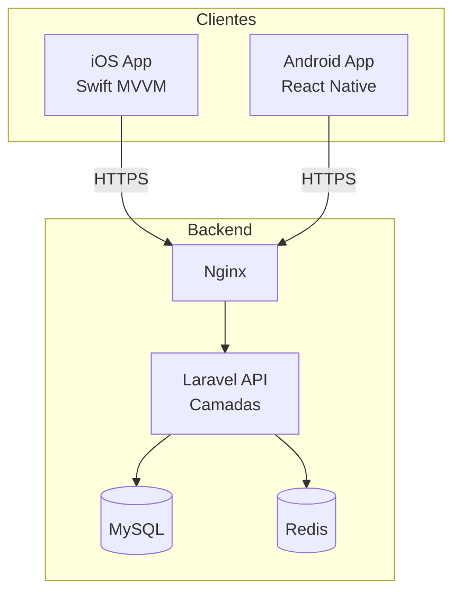

<p align="center">
  
  
  
</p>

<h1 align="center">RotinaPlus</h1>

<p align="center">
  <strong>Organize sua rotina. Viva com propósito.</strong><br/>
  Plataforma multiplataforma para gestão de rotinas diárias — backend API, app iOS e app Android.
</p>

<p align="center">
  <a href="#-sobre-o-projeto">Sobre</a> ·
  <a href="#-arquitetura">Arquitetura</a> ·
  <a href="#-estrutura-do-monorepo">Estrutura</a> ·
  <a href="#-início-rápido">Início rápido</a> ·
  <a href="#-documentação">Documentação</a> ·
  <a href="#-o-guará">O Guará</a>
</p>

---

## 🐺 Sobre o projeto

**RotinaPlus** é um ecossistema completo para ajudar pessoas a criar, acompanhar e concluir suas rotinas do dia a dia. O projeto é organizado como **monorepo**, com três aplicações independentes que compartilham a mesma API REST.

| Plataforma | Tecnologia | Pasta |
|------------|------------|-------|
| **API** | Laravel 13 · PHP 8.4 | [`backend/`](./backend/) |
| **iOS** | Swift · SwiftUI · MVVM | [`ios/`](./ios/) |
| **Android** | React Native · TypeScript | [`mobile-android/`](./mobile-android/) |

**URL da API (produção):** `http://181.215.135.114/api/v1`

---

## 🏗 Arquitetura



### Backend — camadas

```
Request → Controller (Api/) → Service → Repository → Model
                ↓                ↓
           Form Request         DTO
                ↓
          API Resource → JSON Response
```

### Apps móveis

```
View / Screen → ViewModel / Store → Service → API Client → Backend
```

---

## 📁 Estrutura do monorepo

```
rotinaplus/
├── backend/              # API REST (Laravel + Docker)
│   ├── app/
│   │   ├── Http/Controllers/Api/
│   │   ├── Services/
│   │   ├── Repositories/
│   │   ├── DTOs/
│   │   └── Models/
│   ├── docker/           # PHP-FPM + Nginx
│   ├── routes/api.php
│   └── tests/
├── ios/                  # App iOS nativo
│   └── RotinaPlus/       # MVVM (SwiftUI)
├── mobile-android/       # App Android
│   └── src/              # Screens, services, store
├── docs/                 # Documentação técnica
├── scripts/              # Utilitários (logo, etc.)
└── .github/workflows/    # CI/CD
```

---

## 🚀 Início rápido

### Pré-requisitos

| Ferramenta | Backend | iOS | Android |
|------------|---------|-----|---------|
| Docker Desktop | ✅ | — | — |
| Xcode 15+ | — | ✅ | — |
| Node.js 18+ | — | — | ✅ |
| Android Studio | — | — | ✅ |

### Backend (Docker)

```bash
cd backend
./docker-setup.sh
```

| Serviço | URL |
|---------|-----|
| API | http://localhost:8000 |
| Adminer | http://localhost:8080 |

### iOS

```bash
cd ios
open RotinaPlus.xcodeproj
# Selecione um simulador iPhone → Cmd + R
```

### Android

```bash
cd mobile-android
npm install
npm start          # Metro bundler
npm run android    # Emulador ou dispositivo
```

### Logo do Guará no terminal

```bash
./scripts/guara-logo.sh
```

---

## 📡 API

### Endpoints disponíveis

| Método | Rota | Descrição |
|--------|------|-----------|
| `GET` | `/api/v1/rotinas` | Listar rotinas |
| `POST` | `/api/v1/rotinas` | Criar rotina |
| `GET` | `/api/v1/rotinas/{id}` | Exibir rotina |
| `PUT` | `/api/v1/rotinas/{id}` | Atualizar rotina |
| `DELETE` | `/api/v1/rotinas/{id}` | Remover rotina |

### Resposta de sucesso

```json
{
  "success": true,
  "data": { }
}
```

### Resposta de erro

```json
{
  "success": false,
  "message": "Descrição do erro",
  "errors": {
    "campo": ["mensagem de validação"]
  }
}
```

Documentação completa em [`docs/api.md`](./docs/api.md).

---

## 📚 Documentação

| Documento | Conteúdo |
|-----------|----------|
| [`docs/api.md`](./docs/api.md) | Contratos da API, endpoints e erros |
| [`docs/arquitetura.md`](./docs/arquitetura.md) | Decisões arquiteturais |
| [`docs/infraestrutura.md`](./docs/infraestrutura.md) | Servidores, deploy e ambientes |
| [`backend/README.md`](./backend/README.md) | Setup e camadas do Laravel |
| [`ios/README.md`](./ios/README.md) | Setup do app iOS |
| [`mobile-android/README.md`](./mobile-android/README.md) | Setup do app Android |

---

## 🐺 O Guará

O **guará** (*Chrysocyon brachyurus*) — o lobo-guará — é o mascote oficial do RotinaPlus.

Assim como o guará percorre o cerrado com elegância e constância, o RotinaPlus foi criado para ajudar você a manter suas rotinas com disciplina e leveza. Ágil, único e brasileiro — o guará representa a identidade do projeto.

```
        ████████████        ♥
      ██░░░░░░░░░░░░██      RotinaPlus
     ██░░██░░░░██░░██     organize sua rotina
    ██░░████░░████░░██
    ██░░░░░░██░░░░░░██
     ██░░░░░░░░░░░░██
      ██░░██████░░██
       ██░░░░░░░░██
        ██░░░░░░██
         █░░░░█  █
         █░░░░█  █
          ███   ██
           █     ██
                ███
```

> Execute `./scripts/guara-logo.sh` para ver o mascote colorido no terminal.

---

## 🧪 Testes

```bash
# Backend
cd backend && php artisan test

# Android (typecheck)
cd mobile-android && npm run typecheck
```

---

## 🤝 Contribuindo

1. Faça um fork do repositório
2. Crie uma branch: `git checkout -b feature/minha-feature`
3. Commit suas alterações: `git commit -m "feat: descrição"`
4. Push para a branch: `git push origin feature/minha-feature`
5. Abra um Pull Request

---

## 📄 Licença

Este projeto está sob a licença [MIT](./LICENSE).

---

<p align="center">
  <sub>Feito com ♥ no Brasil · Mascote: Guará 🐺</sub>
</p>
